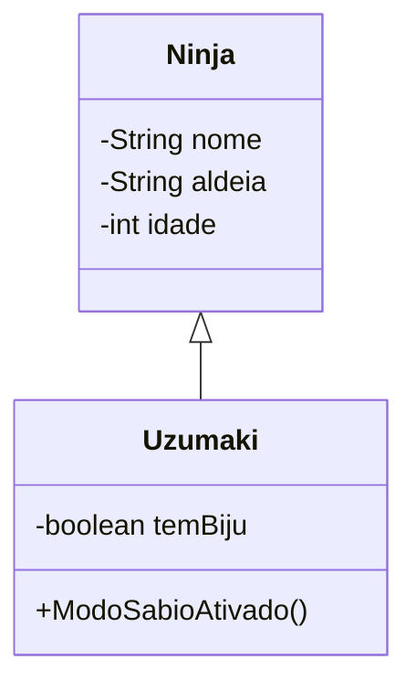

## Primeiro Projeto em Java

### Projeto Naruto

Projeto desenvolvido durante meus primeiros estudos de Java e
Programação Orientada a Objetos, acompanhado pelo conteúdo do canal Fiasco.

### Referência

Canal/aula utilizada como base:
[https://www.youtube.com/watch?v=OIYWA1GwCEs&list=WL&index=1]

## Testando Modelagem de Sistemas (UML)

### Diagrama de Classes

