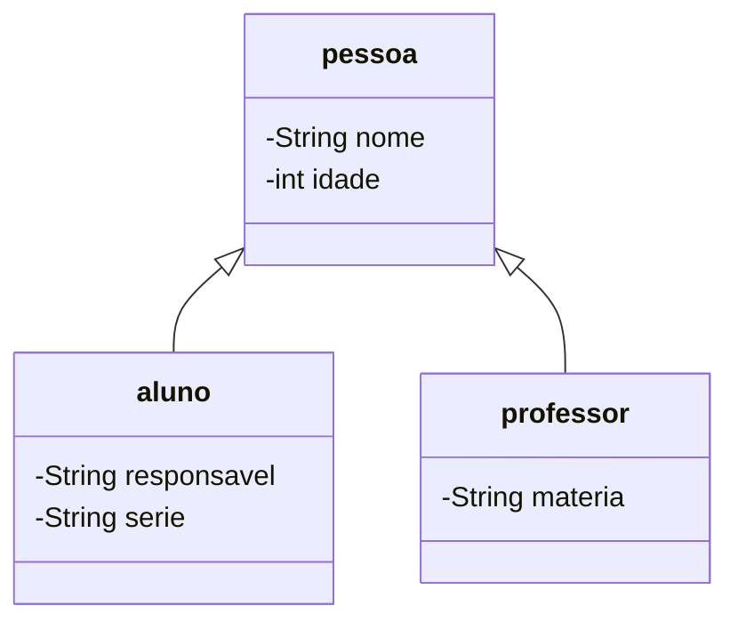

# Aula 01

```mermaid
    classDiagram
        pessoa <|-- aluno
        pessoa <|-- professor
        
        class pessoa {
            -String nome
            -int idade

        }
        class aluno {
            -String responsavel
            -String serie
        }
        class professor {
            -String materia
        }

```