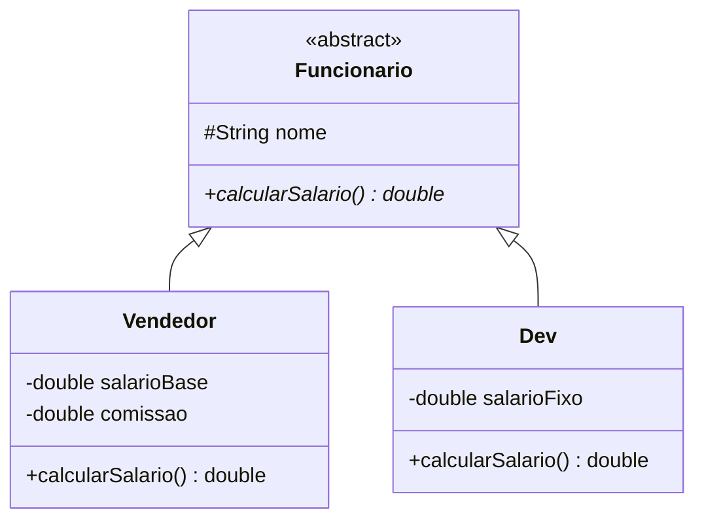

# Aula 03

```mermaid 
    classDiagram
        Funcionario <|-- Vendedor
        Funcionario <|-- Dev
        class Funcionario {
            <<abstract>>
            #String nome

            +calcularSalario()* double
        }
        class Vendedor {
            -double salarioBase
            -double comissao

            +calcularSalario() double
        }
        class Dev {
            -double salarioFixo

            +calcularSalario() double
        }


``` 