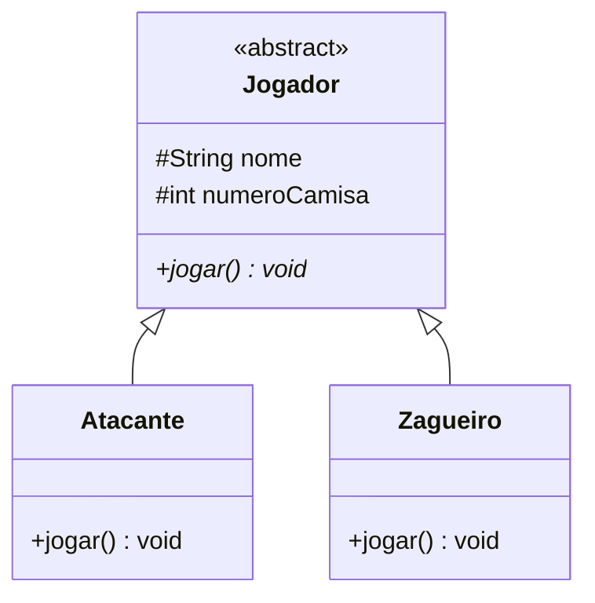

# Aula 05

## Class Diagram

```mermaid
    classDiagram
        Jogador <|-- Atacante
        Jogador <|-- Zagueiro
        class Jogador {
            <<abstract>>
            #String nome
            #int numeroCamisa

            +jogar()* void
        }
        class Atacante {
            +jogar() void
        }
        class Zagueiro {
            +jogar() void
        }

```