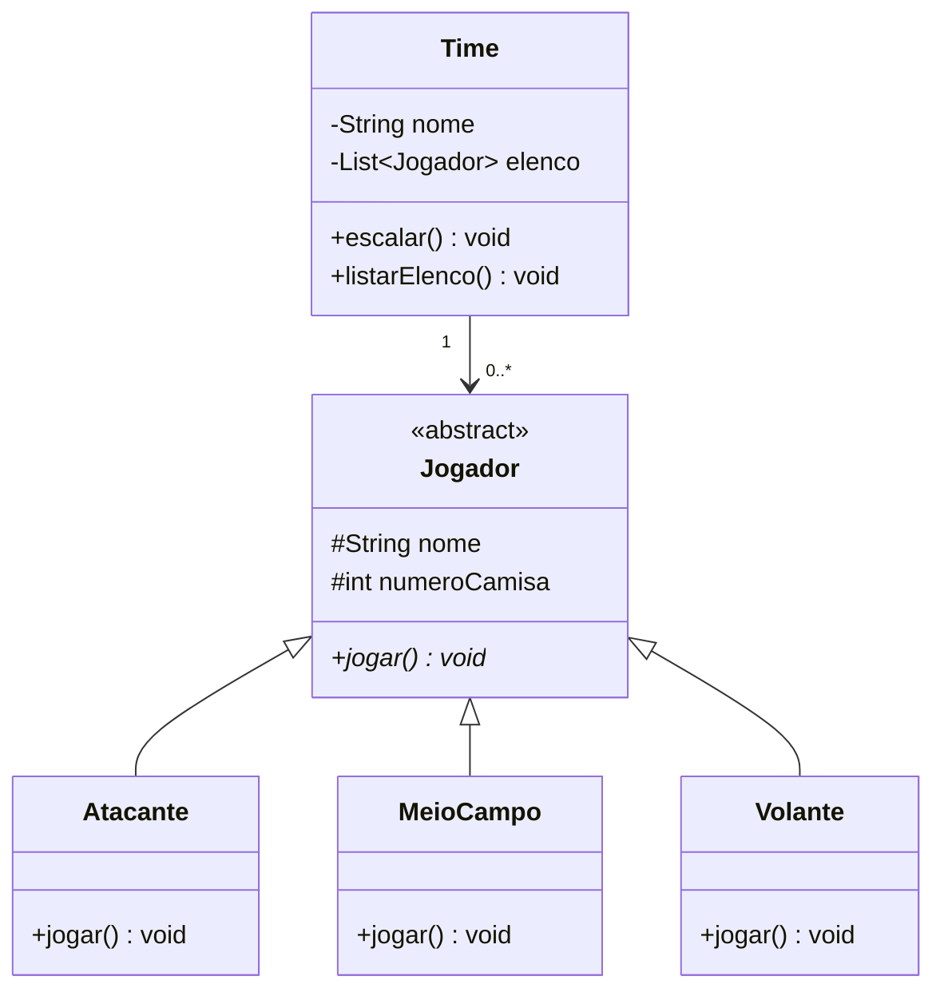

# Aula 07

## Class Diagram

```mermaid
    classDiagram
        Time "1" --> "0..*" Jogador
        Jogador <|-- Atacante
        Jogador <|-- MeioCampo
        Jogador <|-- Volante
        class Time {
        -String nome
        -List~Jogador~ elenco

        +escalar() void
        +listarElenco() void
        }
        class Jogador {
            <<abstract>>
            #String nome
            #int numeroCamisa

            +jogar()* void
        }
        class Atacante {
            +jogar() void
        }
        class MeioCampo {
            +jogar() void
        }
        class Volante {
            +jogar() void
        }

```