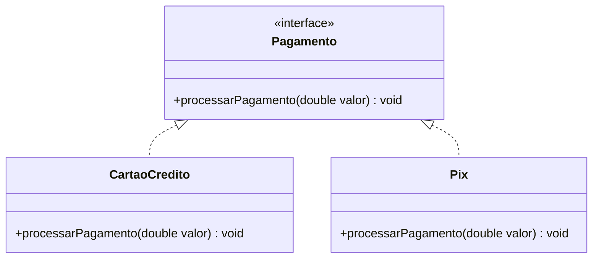

# Aula 11

## Class Diagram

```mermaid 
    classDiagram
        Pagamento <|.. CartaoCredito
        Pagamento <|.. Pix
        class Pagamento {
            <<interface>>
            +processarPagamento(double valor) void
        }
        class CartaoCredito {
            +processarPagamento(double valor) void
        }
        class Pix {
            +processarPagamento(double valor) void
        }
```