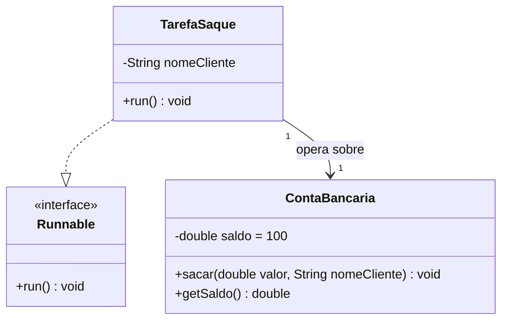

## Class Diagram

```mermaid 
    classDiagram
        TarefaSaque ..|> Runnable
        TarefaSaque "1" --> "1" ContaBancaria : opera sobre

        class ContaBancaria {
            -double saldo = 100

            +sacar(double valor, String nomeCliente) void
            +getSaldo() double
        }

        class TarefaSaque {
            -String nomeCliente

            +run() void
        }

        class Runnable {
            <<interface>>
            +run() void
        }
```