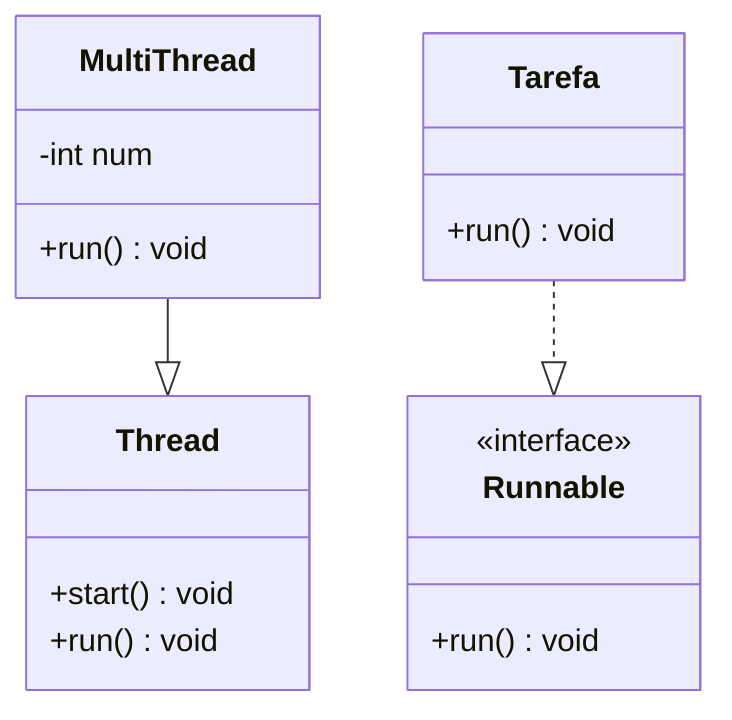

# Aula 13

## Class Diagram

```mermaid
    classDiagram
        MultiThread --|> Thread
        Tarefa ..|> Runnable

        class MultiThread {
            -int num
            +run() void
        }
        class Tarefa {
            +run() void
        }
        class Thread {
            +start() void
            +run() void
        }
        class Runnable {
            <<interface>>
            +run() void
        }
```