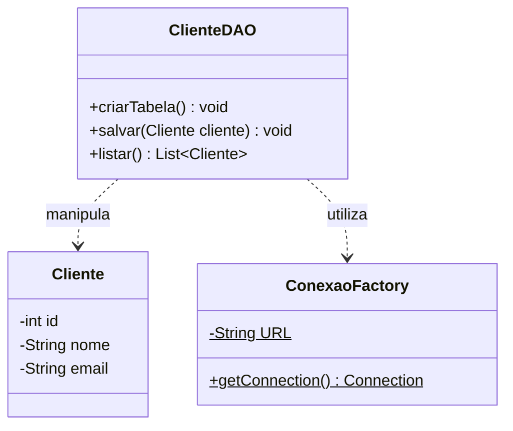

# Aula 15

## Class Diagram

```mermaid 
    classDiagram
        ClienteDAO ..> Cliente : manipula
        ClienteDAO ..> ConexaoFactory : utiliza

        class Cliente {
            -int id
            -String nome
            -String email
        }

        class ClienteDAO {
            +criarTabela() void
            +salvar(Cliente cliente) void
            +listar() List~Cliente~
        }

        class ConexaoFactory {
            -String URL$
            +getConnection() Connection$
        }
```