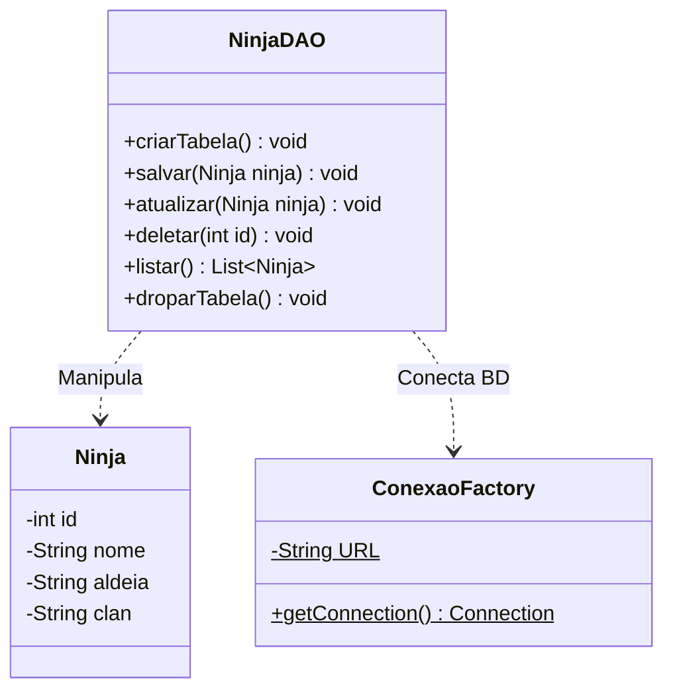

# Aula 16

## Class Diagram

### fluxo da aplicação

Limpeza e Inicialização: Prepara o banco do zero sem duplicados.

CREATE: Insere os 4 ninjas (IDs de 1 a 4).

READ: Lista os 4 ninjas originais.

UPDATE: Altera o ninja de ID 3.

DELETE: Apaga o ninja de ID 4 (Killer Bee foi removido com sucesso!).

READ (Final): Exibe a lista final contendo exatamente os IDs 1, 2 e 3 com o nome atualizado!