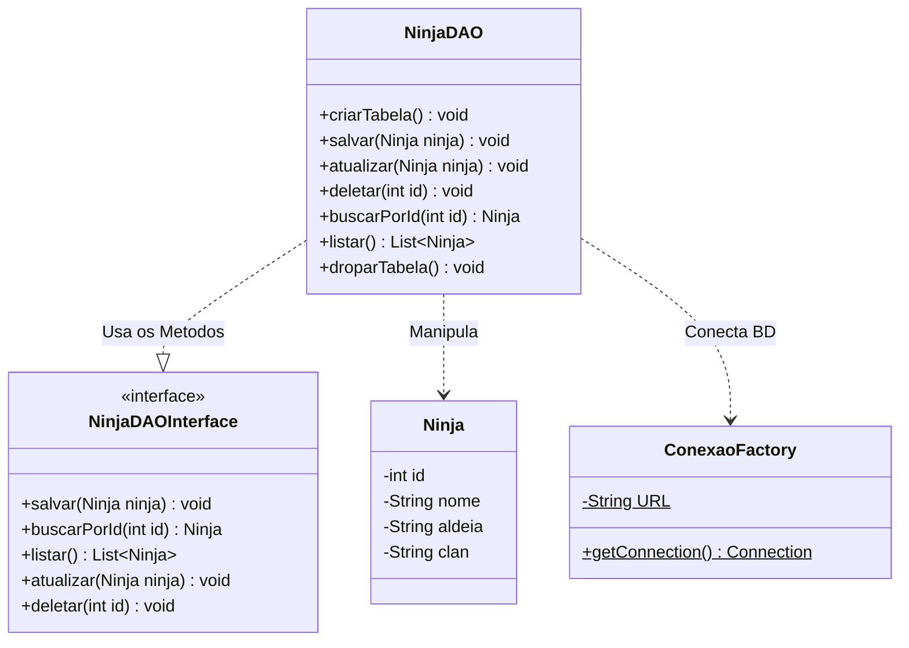

# Aula 17

## Class Diagram

```mermaid 
    classDiagram
        NinjaDAO ..|> NinjaDAOInterface : Usa os Metodos
        NinjaDAO ..> Ninja : Manipula
        NinjaDAO ..> ConexaoFactory : Conecta BD
        class Ninja {
            -int id
            -String nome
            -String aldeia
            -String clan
        }
        class NinjaDAO {
            +criarTabela() void
            +salvar(Ninja ninja) void
            +atualizar(Ninja ninja) void
            +deletar(int id) void
            +buscarPorId(int id) Ninja
            +listar() List~Ninja~
            +droparTabela() void
        }
        class NinjaDAOInterface {
            <<interface>>
            +salvar(Ninja ninja) void
            +buscarPorId(int id) Ninja
            +listar() List~Ninja~
            +atualizar(Ninja ninja) void
            +deletar(int id) void
        }
        class ConexaoFactory {
            -String URL$

            +getConnection() Connection$
        }
```