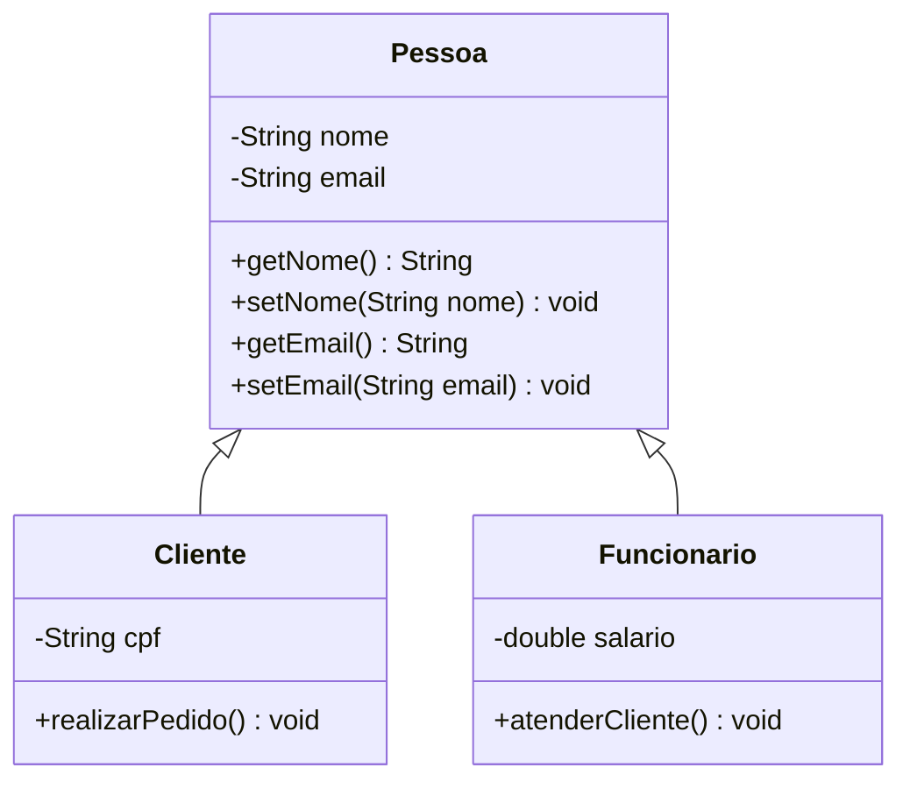

# Diagrama de classes

```mermaid
    classDiagram
        class Pessoa {
            -String nome
            -String email

            +getNome() String
            +setNome(String nome) void
            +getEmail() String
            +setEmail(String email) void
        }
        class Cliente {
            -String cpf
            
            +realizarPedido() void
        }
        class Funcionario {
            -double salario

            +atenderCliente() void
        }
        Pessoa <|-- Cliente
        Pessoa <|-- Funcionario
```