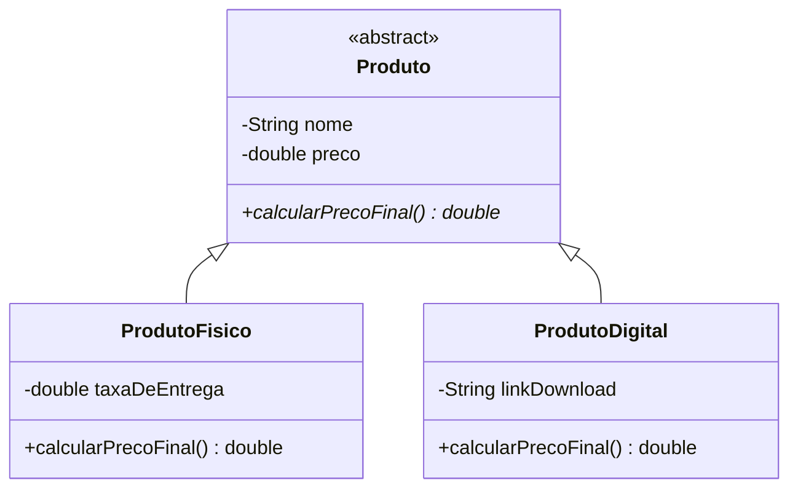

# Diagrama de Classes

```mermaid
    classDiagram
  Produto <|-- ProdutoFisico
  Produto <|-- ProdutoDigital
  class Produto {
    <<abstract>>
    -String nome
    -double preco

    +calcularPrecoFinal()* double
  }
  class ProdutoFisico {
    -double taxaDeEntrega
    
    +calcularPrecoFinal() double
  }
  class ProdutoDigital {
    -String linkDownload

    +calcularPrecoFinal() double
  }

```