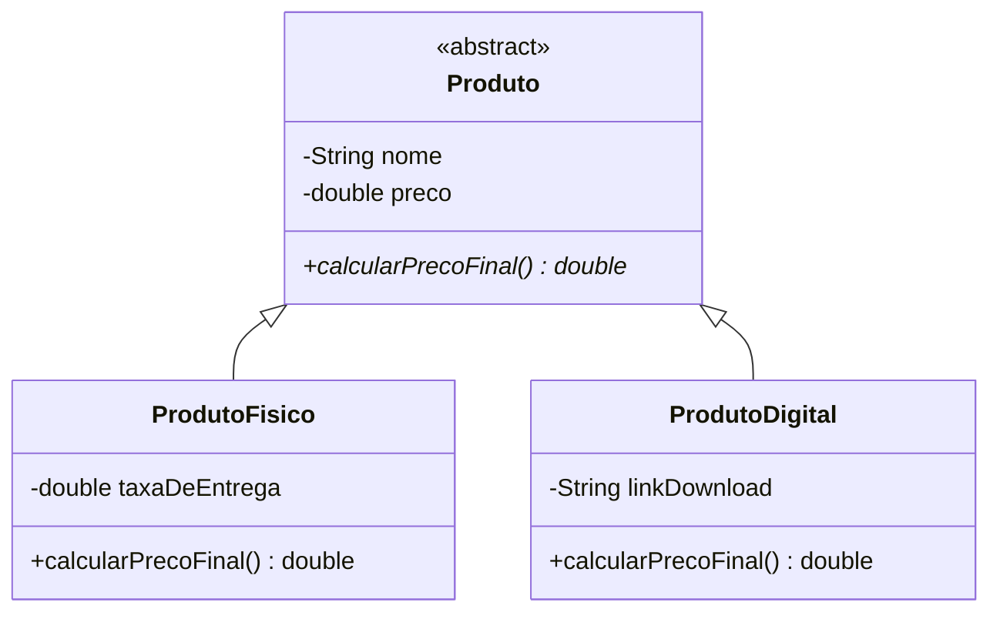

# Diagrama de Classes

## Saída no Console

** Desafío do Gemini **

-> Produto fisíco
Produto: Dipirona 1G
Preço do Produto: R$ 25.0
Taxa entrega: R$ 5.0
Preço Total: R$ 30.0

-> Produto ditital
Produto: GTA VI
Preço Produto: R$ 499.99
Link Dowload: simulandoLinkDowload_hahah%4&$¨*@#23kkkk
Preço total: R$ 499.99