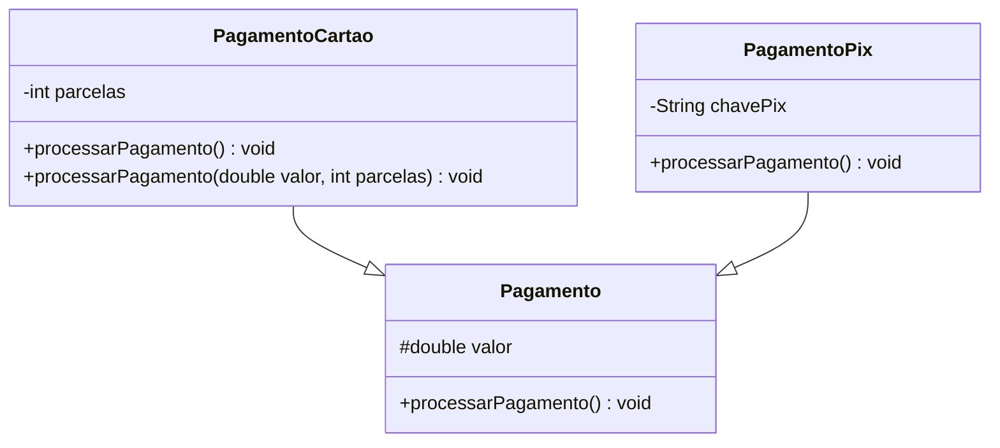

## Exercicio de Polimorfismo ex02

apenas para a fixação da matéria.

## Class Diagram

```mermaid 
    classDiagram
        PagamentoCartao --|> Pagamento
        PagamentoPix --|> Pagamento
        class Pagamento {
            #double valor

            +processarPagamento() void
        }
        class PagamentoCartao {
            -int parcelas

            +processarPagamento() void
            +processarPagamento(double valor, int parcelas) void
        }
        class PagamentoPix {
            -String chavePix

            +processarPagamento() void
        }
```